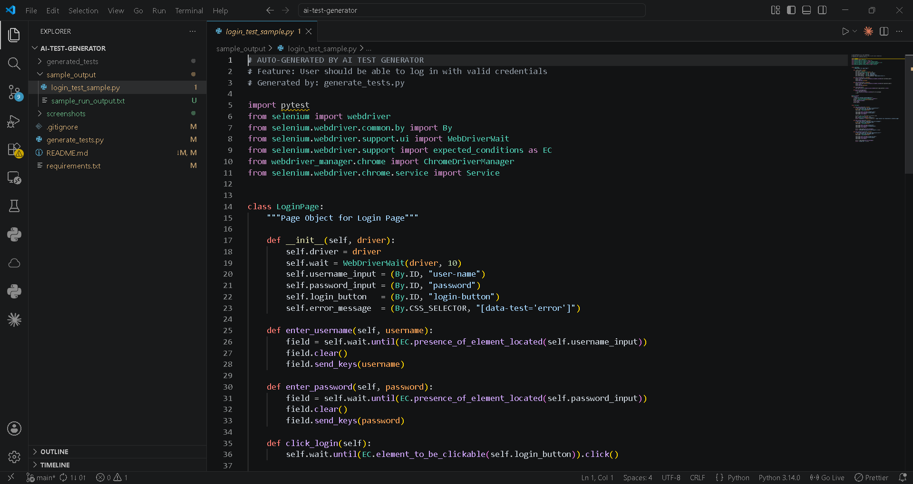

# AI-Assisted Test Case Generator

A Python-based AI-assisted testing utility that converts plain-English functional requirements into structured Selenium WebDriver automation scripts using OpenAI models. The tool helps reduce manual test design effort while promoting scalable automation practices such as Page Object Model (POM) and reusable test architecture.

---

## Overview

Traditional test case creation can be repetitive and time-consuming. This project leverages the OpenAI API to automatically generate Selenium WebDriver test scripts from natural-language requirements, enabling QA engineers to accelerate test design and improve productivity.

The generated output follows automation best practices, including Page Object Model (POM), explicit waits, reusable methods, and structured assertions.

---

## Tech Stack

- Python
- OpenAI API (GPT-3.5-turbo)
- Selenium WebDriver
- webdriver-manager
- Page Object Model (POM)
- Command Line Interface (CLI)

---

## Features

- Converts plain-English requirements into Selenium automation scripts
- Generates structured Page Object Model (POM) code
- Includes explicit waits and validation assertions
- Reduces manual test case creation effort
- Produces reusable automation templates
- Command-line based workflow for rapid test generation
- Demonstrates practical AI integration for QA engineering

---

## Project Structure

```text
ai-test-generator/
├── generate_tests.py
├── requirements.txt
├── sample_output/
│   ├── login_test_sample.py
│   └── sample_run_output.txt
├── screenshots/
│   └── project-preview.png
└── README.md
```

---

## How It Works

### Input

```bash
python generate_tests.py "User should be able to log in with valid credentials"
```

### Processing

The application sends the requirement to the OpenAI API with a structured prompt designed to generate Selenium automation code.

### Output

The tool automatically generates:

- Page Object Model structure
- Selenium automation script
- Explicit waits
- Assertions
- Reusable automation components

---

## Installation

### Clone Repository

```bash
git clone https://github.com/KaveriC-tech/ai-test-generator.git
cd ai-test-generator
```

### Install Dependencies

```bash
pip install -r requirements.txt
```

### Configure API Key

Linux/macOS:

```bash
export OPENAI_API_KEY="your-api-key"
```

Windows CMD:

```cmd
set OPENAI_API_KEY=your-api-key
```

Windows PowerShell:

```powershell
$env:OPENAI_API_KEY="your-api-key"
```

---

## Running the Application

```bash
python generate_tests.py "User should be able to log in with valid credentials"
```

---

## Sample Output

Example generated test script:

```text
sample_output/login_test_sample.py
```

The generated output demonstrates:

- Selenium WebDriver automation
- Page Object Model implementation
- Explicit waits
- Assertions
- Reusable automation design

---

## Project Preview



---

## Why This Project

This project explores how AI can improve software quality engineering workflows by automating repetitive test design activities.

It demonstrates:

- OpenAI API integration
- Python scripting
- Selenium automation
- Prompt engineering
- Test generation workflows
- Scalable QA automation practices

---

## Future Enhancements

- Playwright test generation support
- API test case generation using Postman collections
- CI/CD integration
- Support for multiple automation frameworks
- Web-based user interface
- Enhanced prompt optimization
- BDD-style test generation
- Automatic test data generation

---

## Author

**Kaveri C**
QA Automation Engineer

LinkedIn: https://www.linkedin.com/in/c-kaveri789/

GitHub: https://github.com/KaveriC-tech

---

Built to demonstrate AI-assisted QA workflows, automation engineering practices, and practical applications of generative AI in software testing.
